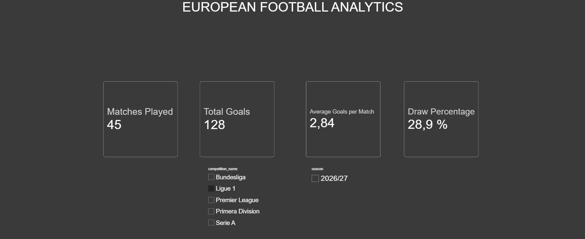
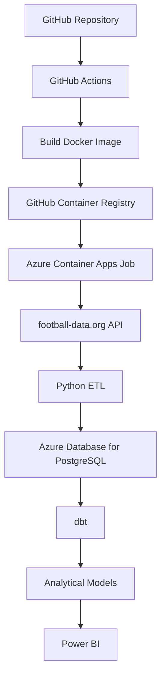
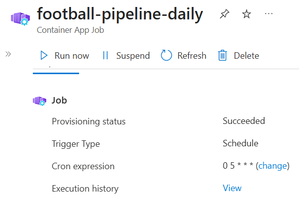
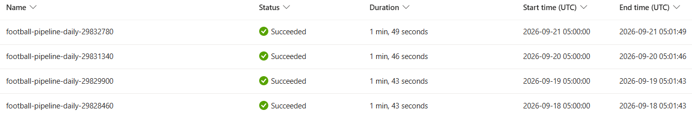
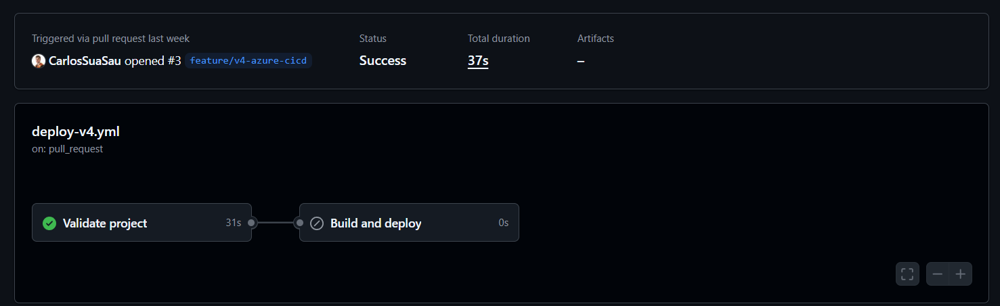
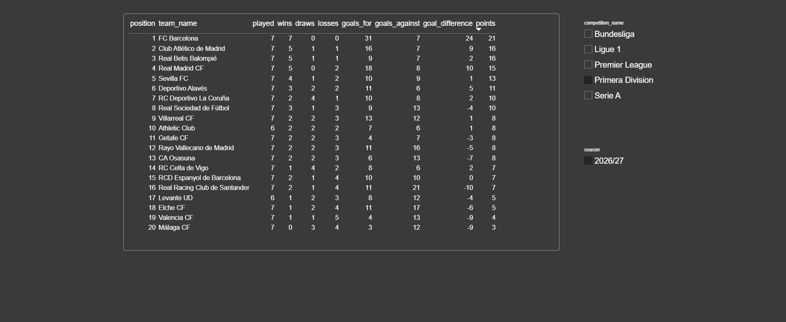
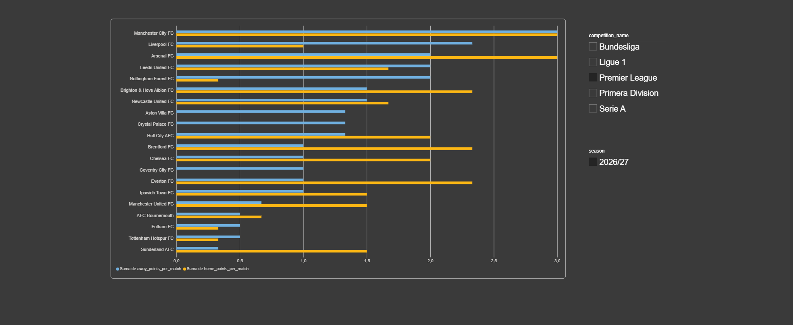
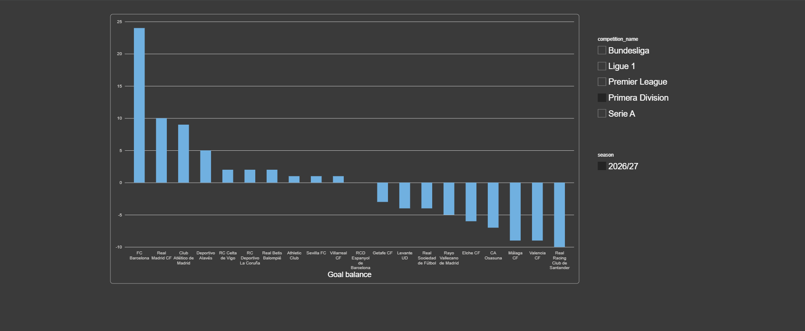

# European Football Data Pipeline

A complete data project that automatically collects football match data from the five major European leagues, processes it, stores it in the cloud and makes the results available through an interactive Power BI dashboard.

The goal of the project is to demonstrate how raw data can be transformed into useful and continuously updated information without requiring manual intervention.

The system automatically:

- retrieves the latest football data;
- stores and updates matches, teams and competitions;
- checks that the data is valid;
- prepares analytical tables;
- updates the cloud database every day;
- makes the results available for reporting in Power BI.

The production pipeline runs in Microsoft Azure, so it does not depend on my computer being switched on.

## Live Dashboard

The latest analytical results can be explored through the public Power BI dashboard:

### [Open the interactive Power BI dashboard](https://app.powerbi.com/view?r=eyJrIjoiMWYwYzcxOWUtZGIzNC00MzllLTg0YTAtZDVhZmQ5MzQ5ZDIxIiwidCI6ImIyYmI3MzFjLTQ2MGQtNDIwZi1hNDc1LTNlZDYxNWE4Mjk4NyIsImMiOjh9)

The dashboard allows users to switch between leagues and explore current statistics, league standings, home and away performance, and goal differences.



---

## What the project does

The pipeline processes data from:

- LaLiga
- Premier League
- Bundesliga
- Serie A
- Ligue 1

For each competition it stores information such as:

- teams;
- fixtures;
- match dates;
- match status;
- scores;
- winners;
- season information.

The analytical layer then derives information such as:

- league standings;
- points;
- wins, draws and losses;
- goals scored and conceded;
- goal difference;
- home performance;
- away performance;
- average goals per match.

The process is designed to be idempotent: running it repeatedly does not duplicate existing teams, competitions or matches. Existing matches are updated when new information becomes available.

---

# Cloud Architecture



The production workflow is fully cloud-based.

Every day, Azure starts a container containing the complete pipeline. The container retrieves the latest football data, loads it into PostgreSQL, runs the analytical transformations and validates the resulting data.

Power BI uses the analytical data stored in Azure PostgreSQL.

---

# Production Pipeline

The production container executes the following sequence:

```text
football-data.org
        |
        v
Python extraction
        |
        v
Data transformation and validation
        |
        v
Azure Database for PostgreSQL
        |
        v
dbt run
        |
        v
Analytical models
        |
        v
dbt test
        |
        v
Power BI
```

If an important stage fails, the container exits with an error and Azure reports the execution as failed.

The pipeline also includes protection against invalid upstream data. If the external API temporarily returns an invalid match status, the pipeline retries the affected match individually. If the source remains invalid, that match is skipped rather than allowing incorrect data to contaminate the database.

---

# Cloud Deployment

## Azure Container Apps Job

The production pipeline runs as an **Azure Container Apps Job**.

It is scheduled once per day using:

```text
0 5 * * *
```

The schedule is evaluated in UTC.

The Job can also be started manually from Azure when required.



The production environment uses a Consumption workload profile, so compute resources are used only while the pipeline is running.

---

## Successful Cloud Executions

Azure maintains the execution history of the Job.

The following screenshot shows several consecutive scheduled executions completing successfully in the cloud:



Typical execution time is under two minutes.

This means the complete process:

```text
API
→ Python
→ PostgreSQL
→ dbt
→ data tests
```

runs automatically without requiring a local machine.

---

# CI/CD with GitHub Actions

The project includes a GitHub Actions workflow located at:

```text
.github/workflows/deploy-v4.yml
```

Pull requests are automatically validated before being merged.

The CI stage checks:

```text
Repository checkout
        |
        v
Python dependencies
        |
        v
Python syntax validation
        |
        v
dbt project validation
```



For changes merged into `main`, the workflow additionally:

```text
Builds the production Docker image
        |
        v
Publishes the image to GHCR
        |
        v
Authenticates with Microsoft Azure
        |
        v
Updates the Azure Container Apps Job
```

The workflow therefore connects software changes in GitHub directly with the deployed cloud pipeline.

---

## GitHub Container Registry

Production Docker images are stored in:

```text
GitHub Container Registry
ghcr.io
```

The CI/CD workflow publishes:

```text
latest
```

and a version identified by the Git commit SHA.

Using the commit SHA makes it possible to identify exactly which version of the repository has been deployed to Azure.

---

# Secure Azure Authentication

GitHub Actions authenticates with Microsoft Azure using **OpenID Connect (OIDC)**.

No permanent Azure password or client secret is stored in the repository.

The authentication flow is:

```text
GitHub Actions
      |
      v
Temporary OIDC token
      |
      v
Microsoft Entra ID
      |
      v
Azure Resource Group
```

The GitHub identity only receives access to the Azure Resource Group used by this project.

---

# Azure Database for PostgreSQL

Production data is stored in **Azure Database for PostgreSQL Flexible Server**.

The database contains two main layers.

## Raw / ingestion layer

Schema:

```text
public
```

Main tables:

```text
competitions
seasons
teams
season_teams
matches
```

These tables contain the data extracted and normalized from football-data.org.

## Analytical layer

Schema:

```text
analytics
```

The analytical models are generated using dbt.

The main models are:

### `fct_matches`

Enriched match-level information including:

- competition;
- season;
- home and away teams;
- result;
- goals;
- points;
- match outcome.

### `team_match_results`

Transforms every finished match into one record per team.

This makes it easier to calculate team-level statistics.

### `team_standings`

Generates league-level metrics including:

- matches played;
- wins;
- draws;
- losses;
- goals for;
- goals against;
- goal difference;
- points;
- home performance;
- away performance.

---

# Data Quality

The dbt project includes automated tests for:

- primary-key uniqueness;
- required values;
- table relationships;
- accepted match statuses;
- accepted match winners;
- invalid team combinations.

The production container executes:

```text
dbt run
```

followed by:

```text
dbt test
```

An execution is only considered successful if the pipeline and its data-quality checks complete correctly.

---

# Power BI Dashboard

Power BI reads the analytical models created by dbt rather than querying the raw ingestion tables directly.

The report is connected to the PostgreSQL database hosted in Azure.

It is refreshed after the daily data pipeline.

## Overview

The Overview page provides high-level information for the selected league:

- matches played;
- total goals;
- average goals per match;
- draw percentage.


## League Standings

The standings page displays the current league table including:

- matches played;
- wins;
- draws;
- losses;
- goals scored;
- goals conceded;
- goal difference;
- points.



## Home vs Away Performance

This view compares the average number of points obtained by each team when playing at home and away.



## Goal Difference

This page compares teams according to their current goal difference.



All pages allow the user to switch between competitions.

### [Explore the live dashboard](https://app.powerbi.com/view?r=eyJrIjoiMWYwYzcxOWUtZGIzNC00MzllLTg0YTAtZDVhZmQ5MzQ5ZDIxIiwidCI6ImIyYmI3MzFjLTQ2MGQtNDIwZi1hNDc1LTNlZDYxNWE4Mjk4NyIsImMiOjh9)

---

# Local Development

The cloud deployment introduced in V4 does not replace the local development environment.

The V3 architecture remains available using:

```text
Docker Compose
        |
        +-- PostgreSQL
        |
        +-- Apache Airflow
                |
                +-- Python ingestion
                |
                +-- dbt run
                |
                +-- dbt test
```

Airflow is used to demonstrate pipeline orchestration in the local development environment.

The production Azure environment uses Azure Container Apps Jobs instead.

This keeps local development simple while avoiding the cost and complexity of maintaining a permanent Airflow deployment in the cloud.

---

# Docker Images

Two Docker configurations are maintained.

## Local Airflow image

```text
Dockerfile.airflow
```

Used by the V3 Docker Compose environment.

## Production image

```text
Dockerfile.prod
```

Contains everything required to execute:

```text
Python ingestion
        |
        v
dbt run
        |
        v
dbt test
```

The same production image can be executed locally or inside Azure by changing its environment variables.

---

# Technologies

## Data Engineering

- Python
- SQL
- PostgreSQL
- ETL
- dbt

## Data Visualization

- Power BI

## Containerization and Orchestration

- Docker
- Docker Compose
- Apache Airflow
- Azure Container Apps Jobs

## Cloud

- Microsoft Azure
- Azure Database for PostgreSQL Flexible Server
- Azure Container Apps
- Microsoft Entra ID

## CI/CD and Version Control

- Git
- GitHub
- GitHub Actions
- GitHub Container Registry
- OpenID Connect (OIDC)

---

# Security

No production credentials are committed to the repository.

Sensitive information such as:

- football-data.org API tokens;
- PostgreSQL passwords;
- Azure secrets;

is provided through:

```text
Environment variables
Azure Container Apps secrets
GitHub configuration
```

Local secret files are excluded through `.gitignore`.

GitHub Actions uses OIDC authentication instead of storing a permanent Azure client secret.

---

# Repository Structure

```text
.
├── .github/
│   └── workflows/
│       └── deploy-v4.yml
│
├── airflow/
│   └── dags/
│
├── dbt_football/
│   ├── models/
│   └── tests/
│
├── docs/
│   └── images/
│       ├── azure_job.png
│       ├── executions.png
│       ├── github_actions.png
│       ├── pag1.png
│       ├── pag2.png
│       ├── pag3.png
│       └── pag4.png
│
├── powerbi/
│
├── api.py
├── transform.py
├── database.py
├── main.py
├── run_pipeline.py
│
├── Dockerfile.airflow
├── Dockerfile.prod
├── docker-compose.yml
├── requirements.txt
├── schema.sql
└── README.md
```

---

# Project Evolution

The project was intentionally developed in several versions, with each version introducing a new data-engineering concept.

## V1 — Python + PostgreSQL

Initial ETL pipeline.

```text
football-data.org
        ↓
Python
        ↓
PostgreSQL
```

Implemented:

- API extraction;
- data transformation;
- relational database design;
- PostgreSQL upserts;
- idempotent ingestion.

## V2 — dbt + Power BI

Added an analytical layer.

```text
PostgreSQL
     ↓
    dbt
     ↓
Analytical models
     ↓
Power BI
```

Implemented:

- staging models;
- analytical marts;
- automated data-quality tests;
- team standings;
- team performance metrics;
- Power BI reporting.

## V3 — Docker + Airflow

Containerized the local environment and introduced orchestration.

```text
Docker Compose
        ↓
Airflow
        ↓
Python
        ↓
PostgreSQL
        ↓
dbt
```

Implemented:

- containerized PostgreSQL;
- persistent Docker volumes;
- custom Airflow image;
- scheduled DAG;
- task dependencies;
- retries;
- execution logs.

## V4 — Azure + CI/CD

Moved the production pipeline to the cloud.

```text
GitHub
   ↓
GitHub Actions
   ↓
GitHub Container Registry
   ↓
Azure Container Apps Job
   ↓
football-data.org
   ↓
Python
   ↓
Azure PostgreSQL
   ↓
dbt
   ↓
Power BI
```

Implemented:

- production Docker image;
- GitHub Container Registry;
- GitHub Actions CI/CD;
- OIDC authentication with Azure;
- Azure Container Apps Jobs;
- scheduled daily cloud execution;
- Azure Database for PostgreSQL;
- cloud execution monitoring;
- public Power BI dashboard.

---

# Current Version

## V4 — Azure Cloud Deployment

The complete production pipeline is currently deployed and operational in Microsoft Azure.

It can collect, process, validate and publish updated football data automatically without requiring a local machine.

### [View the live Power BI dashboard](https://app.powerbi.com/view?r=eyJrIjoiMWYwYzcxOWUtZGIzNC00MzllLTg0YTAtZDVhZmQ5MzQ5ZDIxIiwidCI6ImIyYmI3MzFjLTQ2MGQtNDIwZi1hNDc1LTNlZDYxNWE4Mjk4NyIsImMiOjh9)

---

# Data Source

Football data is provided by [football-data.org](https://www.football-data.org/).

This project is an independent data-engineering portfolio project and is not affiliated with football-data.org or the football competitions represented in the dataset.